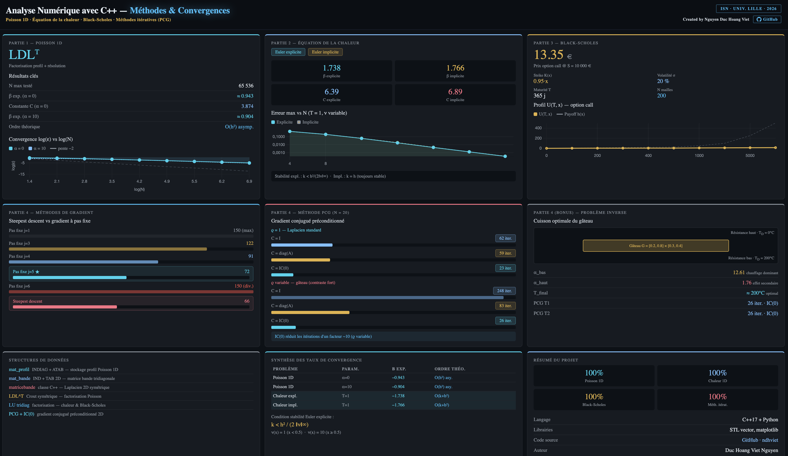

<div align="center">
  <h1>Projet d’Analyse Numérique en C++</h1>
  <p><em>M1 — Université de Lille | Résolution numérique d’EDP classiques</em></p>

  <a href="#">
    
  </a>
  
  <a href="#">
    
  </a>

  <a href="#">
    
  </a>

  <a href="#">
    
  </a>

  <a href="#">
    
  </a>

  <a href="#">
    
  </a>

  <a href="https://ndhviet.github.io/Projet-Analyse-numerique-Cplus-M1-UniLille/images/dashboard.html">
    
  </a>

  <a href="#">
    
  </a>
</div>

<br>


# Projet Analyse numerique avec C++ M1-Université de Lille

Ce projet présente la mise en œuvre de différentes méthodes numériques en C++ pour la résolution d’équations différentielles partielles classiques, avec discrétisation par différences finies et résolution de systèmes linéaires.

## Table des Matières

- [Introduction](#introduction)
- [Prérequis](#prérequis)
- [Résolution du problème de Poisson 1D](#résolution-du-problème-de-poisson-1d)
- [Schémas numériques pour l’équation de la chaleur](#schémas-numériques-pour-l’équation-de-la-chaleur)
- [Résolution de l’équation de Black–Scholes](#résolution-de-l’équation-de-black–scholes)
- [Méthodes itératives pour les matrices creuses : Application à la température optimale d’un four pour la cuisson d’un gâteau](#méthodes-itératives-pour-les-matrices-creuses-application-à-la-température-optimale-d’un-four-pour-la-cuisson-d’un-gâteau)
- [Structure](#structure)

## Introduction

Présentation des objectifs du projet et du cadre général de l’analyse numérique appliquée avec le langage C++.
Pour plus de détails, vous pouvez consulter le [fichier PDF](Project_Analyse_numerique_en_C__.pdf).

## Prérequis

- CMake version >= 3.10
- Compilateur C++ compatible C++17 (ex : g++, clang++)
- Git 
- Connexion Internet (pour récupérer les dépendances la première fois)

Pour chaque répertoire, entrer et créer un dossier build et puis se placer dedans :
```bash
mkdir build
cd build
cmake ..
cmake --build . --target run_all 
```

## Résolution du problème de Poisson 1D

Implémentation de la méthode numérique pour résoudre l’équation de Poisson en une dimension.
Le projet aborde la représentation des matrices sous forme profil, la factorisation LDLᵗ et la résolution du système associé.
Des tests numériques et des graphiques sont réalisés pour vérifier la précision des résultats. 

## Schémas numériques pour l’équation de la chaleur

Étude des méthodes explicite et implicite pour la résolution de l’équation de la chaleur.
Les conditions initiales et aux bords sont définies, puis les schémas sont comparés à travers des simulations, vérifications et représentations graphiques des résultats.

## Résolution de l’équation de Black–Scholes

Application des méthodes numériques au modèle de Black–Scholes en finance.
Le projet comprend l’initialisation du problème, la construction d’une matrice bande, la mise en œuvre d’un algorithme de résolution simplifié, et la visualisation des résultats à l’aide de graphes 2D, 3D et de cartes thermiques (heat maps).

## Méthodes itératives pour les matrices creuses : Application à la température optimale d’un four pour la cuisson d’un gâteau
On étudie dans ce projet le champ de température d’un gâteau à cuire dans un four à partir
de la valeur connue des résistences électriques. On suppose le phénomène stationnaire, c’est-à-dire
indépendant du temps (c’est le cas quand le four est arrivé à la température imposée avec le gâteau
à cuir déjà à l’intérieur du four). Le but du projet est la résolution par diverses méthodes itératives
du système linéaire Ax = b qui provient de la discrétisation par différences finies des équations
definissant notre problème.

# Structure
```text
project/
|-- .gitignore
|-- Black-Scholes/
|   └── src/
|       |--Black_Scholes.cpp
|       |--Black_Scholes.h
|       |--main.cpp
|       |--vecteur_template.h
|   └── python/
|       |--graph1.py
|       |--graph2.py
|       |--run_graphs.py
|   CMakeLists.txt
|
|-- Laplacien/
|   └── src/
|       |--main_inverse.cpp
|       |--main.cpp
|       |--main2.cpp
|       |--matrice.cpp
|       |--matrice.h
|       |--matricebande.cpp
|       |--matricebande.h
|       |--test
|   └── python/
|       |--graph.py
|       |--graph1.py
|       |--graph2.py
|       |--graph3.py
|       |--graph4.py
|       |--run_graphs.py
|   CMakeLists.txt
|
|-- Poisson/
|   └── src/
|       |--main.cpp
|       |--Poisson.cpp
|       |--Poisson.h
|   └── python/
|       |--graph1.py
|       |--graph2.py
|       |--run_graphs.py
|   CMakeLists.txt
|  
|-- Schema_Numerique/
|   └── src/
|       |--main.cpp
|       |--Schema_Numerique.cpp
|       |--Schema_Numerique.h
|   └── python/
|       |--graph1.py
|       |--graph2.py
|       |--run_graphs.py
|   CMakeLists.txt
|
└── README.md
```

### Interactive Dashboard

[](https://ndhviet.github.io/Projet-Analyse-numerique-Cplus-M1-UniLille/images/dashboard.html)

➡️ Click on the image to open the interactive dashboard.
